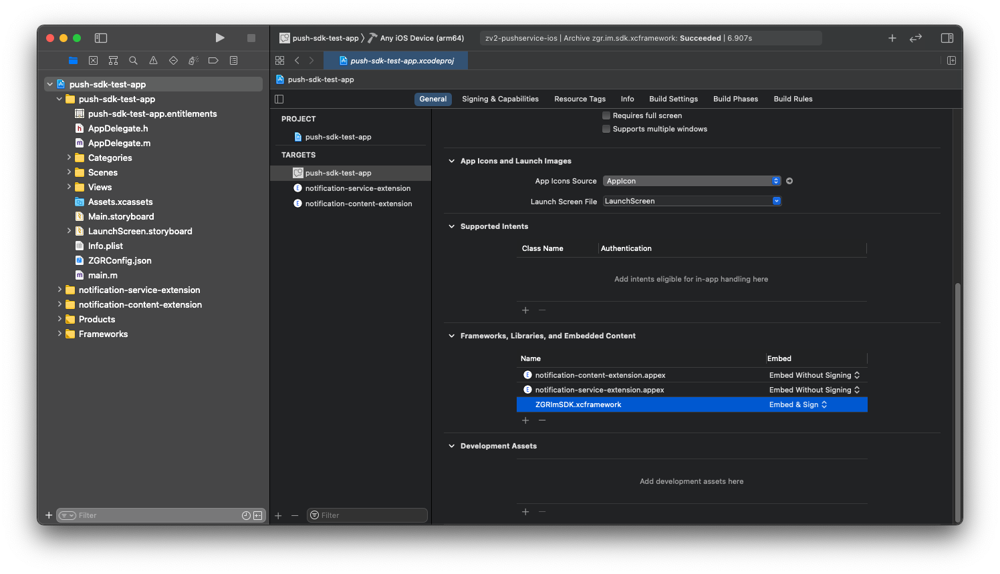
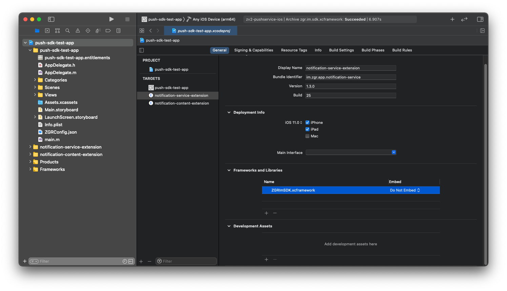
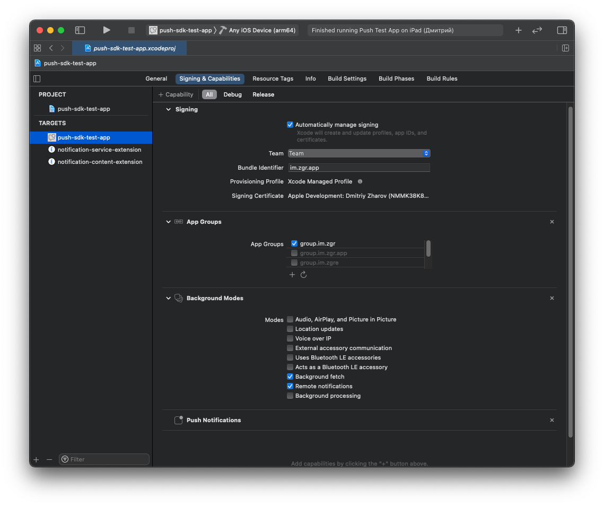
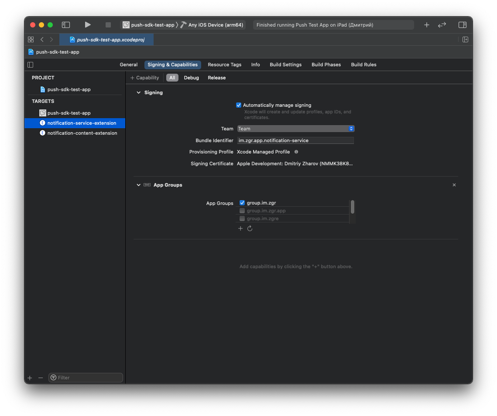
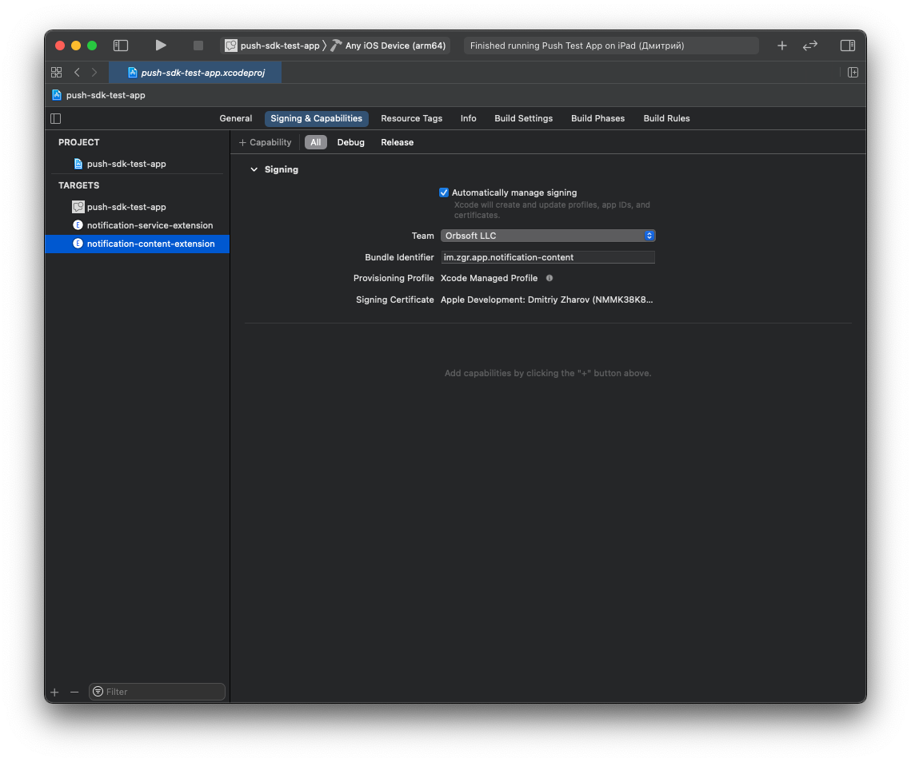

# FAQ

## Setup

### 1. Настройка основного приложения

* Убедиться в наличии всех необходимых файлов от ZGR.
    * `ZGRConfig.json` (файл конфигации)
    * `ZGRImSDK.xcframework` (динамическая универсальная библиотека)
    
* Открыть Xcode и установить фреймворк в приложение: 
    1. Перетянуть полученный от ZGR конфигурационный файл `ZGRConfig.json` в  в иерархию файлов проекта (левая панель в `Xcode`)
    2. Активировать чек-бокс `Copy items if needed`
    3. Перетянуть файл `ZGRImSDK.xcframework` в иерархию файлов проекта (левая панель в `Xcode`)
    4. Активировать чек-бокс `Copy items if needed`
    5. Перейти в основные настройки таргета приложения (первая вкладка), к разделу `Frameworks, Libraries and Embedded Content`, нажать "+"
    6. В открывшемся меню выбрать библиотеку `ZGRImSDK.xcframework`, нажать "Add"
    7. Убедиться, что библиотека будет копироваться в бандл вашего приложения посредством установки пункта `Embed & Sign`
    

* Подключить библиотеку ZGR к `AppDelegate`

Objective-C:

```
#import <ZGRImSDK/ZGRImSDK.h>
```
   
Swift:

```
import ZGRImSDK
```


* Отправить запрос на получение от системы пуш-токена и передать полученный токен в ZGR

Objective-C:

```
- (BOOL)application:(UIApplication *)application didFinishLaunchingWithOptions:(NSDictionary *)launchOptions {
    [application registerForRemoteNotifications];
    return YES;
}

- (void)application:(UIApplication *)application didRegisterForRemoteNotificationsWithDeviceToken:(NSData *)deviceToken {
    [[ZGRMessaging sharedInstance] registerForRemoteNotifications:deviceToken];
}
```
 
Swift:

```
func application(_ application: UIApplication, didFinishLaunchingWithOptions launchOptions: [UIApplication.LaunchOptionsKey : Any]? = nil) -> Bool {
    application.registerForRemoteNotifications()
    return true
}

func application(_ application: UIApplication, didRegisterForRemoteNotificationsWithDeviceToken deviceToken: Data) {
    ZGRMessaging.sharedInstance().register(forRemoteNotifications: deviceToken)
}
```


* Отправить номер телефона пользователя. Для отправки внешнего идентификатора обратитесь к разделу `Быстрый гайд` данной инструкции.

Objective-C:

```
[[ZGRMessaging sharedInstance] saveUserPhoneNumber:@"79876543210" withCompletionHandler^(ZGRUser * _Nullable user, ZGRError * _Nullable error) {
    // Perform any code
}];
```
 
Swift:

```
ZGRMessaging.sharedInstance().saveUserPhoneNumber("79876543210") { user, error in
    // Perform any code
}
```


* Реализовать протокол делегата UNUserNotificationCenterDelegate 

Objective-C:

```
#import <UserNotifications/UserNotifications.h>

@interface AppDelegate () <UNUserNotificationCenterDelegate>
@end 

...

- (BOOL)application:(UIApplication *)application didFinishLaunchingWithOptions:(NSDictionary *)launchOptions {
    [UNUserNotificationCenter currentNotificationCenter].delegate = self;
    UNAuthorizationOptions options = UNAuthorizationOptionAlert | UNAuthorizationOptionSound | UNAuthorizationOptionBadge;
    [[UNUserNotificationCenter currentNotificationCenter] requestAuthorizationWithOptions:options
                                                                        completionHandler:^(BOOL granted, NSError * _Nullable error) {
        [application registerForRemoteNotifications];
        
    }];
    return YES;
}

```
    
Swift:

```
func application(_ application: UIApplication, didFinishLaunchingWithOptions launchOptions: [UIApplication.LaunchOptionsKey: Any]?) -> Bool {
    application.registerForRemoteNotifications()
    
    UNUserNotificationCenter.current().delegate = self
    UNUserNotificationCenter.current().requestAuthorization(options: [.alert, .sound, .badge]) { (granted, error) in
        
    }
    return true
}
```


* Перенаправить пуш-уведомление в ZGR

Objective-C:

```
- (void)userNotificationCenter:(UNUserNotificationCenter *)center didReceiveNotificationResponse:(UNNotificationResponse *)response withCompletionHandler:(void (^)(void))completionHandler {
    [[ZGRMessaging sharedInstance] userNotificationCenter:center
                           didReceiveNotificationResponse:response
                                    withCompletionHandler:^(ZGRNotification * _Nonnull notification,
                                                             ZGRAction * _Nonnull selectedAction) {
    // Handle notification from ZGR
}

    // My own code
    
    completionHandler();
}
```

Swift:

```
func userNotificationCenter(_ center: UNUserNotificationCenter, didReceive response: UNNotificationResponse, withCompletionHandler completionHandler: @escaping () -> Void) {
    ZGRMessaging.sharedInstance().userNotificationCenter(center, didReceive: response) { (notification, action) in
        // Handle notification from ZGR
    }
    
    // My own code
    
    completionHandler()
}
```

* Обработка нажатия на контент уведомления. либо на кнопки под контентом. Для определения нажатой кнопки необходимо сопоставить ее идентификатор
с отправленным в ZGR.
```
[[ZGRMessaging sharedInstance] userNotificationCenter:center
                       didReceiveNotificationResponse:response
                                withCompletionHandler:^(ZGRNotification * _Nonnull notification,
                                                         ZGRAction * _Nonnull selectedAction) {
        // Handle notification from ZGR
    }

    // User clicked notification content
    if (selectedAction.type == ZGRActionTypeDefault) {
        // Perform any code
    }
    
    // User clicked custom button under notification content
    if (selectedAction.type == ZGRActionTypeOther) {
        NSString *customActionId = selectedAction.identifier;
        // Perform any code
    }
}
```


### 2. Создание и настройка расширений приложения

#### Notification Service Extension
* Обязательно для корректной работы SDK.

Сервис, занимающийся в фоне отправкой отчетов о прочтении.

* Создать расширение приложения (extension)
    1. Зайти в меню приложния и на левой панели в нижнем левом углу нажать "+"
    2. В списке расширений выбрать `Notification Service Extension`
    3. Ввести любое название, например:  `notification-service`
    3. Во всплывающем запросе на активацию новосозданной схемы выбрать "Cancel"

* Связать сервис уведомлений с библиотекой `ZGRImSDK.xcframework`
    1. Перейти в основные настройки таргета  `Notification Service Extension`, раздел `Frameworks, Libraries and Embedded Content`, нажать "+"
    2. В открывшемся меню выбрать  `ZGRImSDK.xcframework`, нажать "Add".
    3. Библиотека уже скопирована основным таргетом в бандл приложения, поэтому здесь мы выбираем `Do Not Embed`.
    4. В сгенерированном при создании `extension` файле `NotificationService.h` импортировать `<ZGRImSDK/ZGRNotificationService.h>`.
    5. Сделать класс `NotificationService` наследником `ZGRNotificationService`. В вашем классе вы можете определить свое поведение, которое будет выполнено, если пуш-уведомление получено не от ZGR
    
    
```
#import <ZGRImSDKExtension/ZGRNotificationService.h>

@interface NotificationService : ZGRNotificationService

@end
```

#### Notification Content Extension
* Опционально. Не влияет на корректную работу SDK.

Сервис, занимающийся отображением медиаконтента в пуш-уведомлении.

* Создать расширение приложения (extension).
    1. Зайти в меню приложния и на левой панели в нижнем левом углу нажать "+"
    2. В списке расширений выбрать `Notification Content Extension`
    3. Ввести любое название, например:  `notification-content`
    3. Во всплывающем запросе на активацию новосозданной схемы выбрать "Cancel"

* Связать сервис уведомлений с библиотекой `ZGRImSDK.xcframework`
    1. Перейти в основные настройки таргета  `Notification Content Extension`, раздел `Frameworks, Libraries and Embedded Content`, нажать "+"
    2. В открывшемся меню выбрать  `ZGRImSDK.xcframework`, нажать "Add".
    3. Библиотека уже скопирована основным таргетом в бандл приложения, поэтому здесь мы выбираем `Do Not Embed`.
    4. В сгенерированном при создании `extension` файле  `NotificationViewController.m` (файл реализации класса) импортировать `<ZGRImSDK/ZGRNotificationService.h>`
    5. Передать из метода `- viewDidLoad` стандартную `view` в `[ZGRNotificationContent sharedInstance]` (пример кода ниже)
    6. Передать из метода `- didReceiveNotification:` полученное уведомление в `[ZGRNotificationContent sharedInstance]` (пример кода ниже)
    
    
```
#import <ZGRImSDKExtension/ZGRNotificationContent.h>

@interface NotificationViewController () <UNNotificationContentExtension>

@end

@implementation NotificationViewController

- (void)viewDidLoad {
    [super viewDidLoad];
    [[ZGRNotificationContent sharedInstance] didLoadView:self.view];
}

- (void)didReceiveNotification:(UNNotification *)notification {
    [[ZGRNotificationContent sharedInstance] didReceiveNotification:notification];
}

@end
```

6. В `Info.plist` файле расширения `Notification Content Extension` заменить значение поля `NSExtension/NSExtensionAttributes/UNNotificationExtensionCategory` на `zgr`
7. В этом же файле заменить значение поля `NSExtension/NSExtensionAttributes/UNNotificationExtensionInitialContentSizeRatio`  на `0`.

### 3. Настройка App Group

* Данный шан необходимо выполнить для возможности синхронизации конфигурации и локальной базы данных пушей между основным приложением и его расширениями. Если у вас возникнут трудности с этим шагом, то вам помогут приложенные к инструкции изображения `App_Group_*`.

* Добавить `Сapability` -> `App Group` в возможности вашего приложения.
    1. Перейти в настройки основного таргета вашего приложения.
    2. Перейти во вкладку `Signing & Capabilities`.
    3. Нажать кнопку `+ Capability`.
    4. Выбрать `App Groups`.
    5. В появившемся разделе `App Groups` нажать кнопку `+ (Создание новой группы)`.
    6. В окне `Add a new container` после `group.` ввести идентификатор вашего приложения (`bundle identifier`).
        - Пример: приложение имеет идентификатор `im.zgr.app`, в данное поле необходимо ввести строку `group.im.zgr.app`.
    
        
    7. Без изменений повторить шаги 1-6 для таргета `Notification Service Extension`.
    
    
    
    
    
## Быстрый гайд

* В приложеном тестовом проекте вы найдете примеры использования всех возможностей SDK. Ниже приведены только основные сценарии работы с SDK.

### Профиль пользователя

* Получение профиля
```
[[ZGRMessaging sharedInstance] fetchUserWithCompletionHandler:^(ZGRUser * _Nullable user, ZGRError * _Nullable error) {    
    if (user.externalUserId.lenght > 0) {
        NSLog("External user id: %@" user.externalUserId];
    }
    if (user.phoneNumber.lenght > 0) {
        NSLog("Phone number: %@" user.phoneNumber];
    }
}];
```

* Обновление номера телефона в профиле
```
[[ZGRMessaging sharedInstance] saveUserPhoneNumber:@"79876543210" withCompletionHandler:^(ZGRUser * _Nullable user, ZGRError * _Nullable error) {
    if (user.externalUserId.lenght > 0) {
        NSLog("External user id: %@" user.externalUserId];
    }
    if (user.phoneNumber.lenght > 0) {
        NSLog("Phone number: %@" user.phoneNumber];
    }
    
    // Perform any code
}];
```

### Персонализация

* Персонализация (привязка externalUserId)
```
[[ZGRMessaging sharedInstance] personalizeWithExternalUserId:@"id1" completionHandler:^{
    if (user.externalUserId.lenght > 0) {
        NSLog("External user id: %@" user.externalUserId];
    }
    if (user.phoneNumber.lenght > 0) {
        NSLog("Phone number: %@" user.phoneNumber];
    }

    // Perform any code
}];
```

* Деперсонализация (выход).
```
[[ZGRMessaging sharedInstance] depersonalizeWithCompletionHandler:nil];
```

### Настройки подписок

* Получение настроек с подписками.
```
[[ZGRMessaging sharedInstance] fetchInstallationWithCompletionHandler:^(ZGRInstallation * _Nullable installation, ZGRError * _Nullable error) {
    // Perform any code
    NSLog(@"%@", installation.subscriptions);
}];
```

* Изменение настроек и параметров подписок (вы можете изменять необходимые вам свойство в классах `ZGRInstallation` и `ZGRSubscription`, там же вы найдете подробное описание атрибов).
```
ZGRInstallation *installation = self.installation;
installation.isPrimary = NO;

NSArray<ZGRSubscription *> *subscriptions = installation.subscriptions;
// Perform any code on subscriptions

[[ZGRMessaging sharedInstance] saveInstallation:installation withCompletionHandler:^{
    
}];
```

### Локальная история уведомления

* Включение хранения локальной истории уведомлений.
```
[ZGRMessaging sharedInstance].localDatabaseEnabled = YES;
```

* Получение всех сохраненных уведомлений из базы данных.
```
[[ZGRMessaging sharedInstance] fetchAllNotificationsWithCompletionHandler:^(NSArray<ZGRNotification *> * _Nullable notifications,
                                                                            ZGRError * _Nullable error) {
    // Perform any code
}];
```

* Получение части уведомлений из базы данных.
```
ZGRDatabaseRequest *request = [ZGRDatabaseRequest new];
request.fetchLimit = 5;
request.pageOffset = 1;
request.fromDate = [NSDate dateWithTimeIntervalSinceReferenceDate:*];
[[ZGRMessaging sharedInstance] fetchNotificationsWithRequest:request completionHandler:^(NSArray<ZGRNotification *> * _Nullable notifications,
                                                                                         ZGRError * _Nullable error) {
    // Perform any code
}];
```

* Удаление уведомления из базы данных.
```
[[ZGRMessaging sharedInstance] deleteNotification:notification withCompletionHandler:^(BOOL success, ZGRError * _Nullable error) {
    if (!success) {
        return;
    }

    // Perform any code
}];
```


## Ограничения

Невозможность работы с симуляторами. Необходимо наличие реального мобильного устройства.
